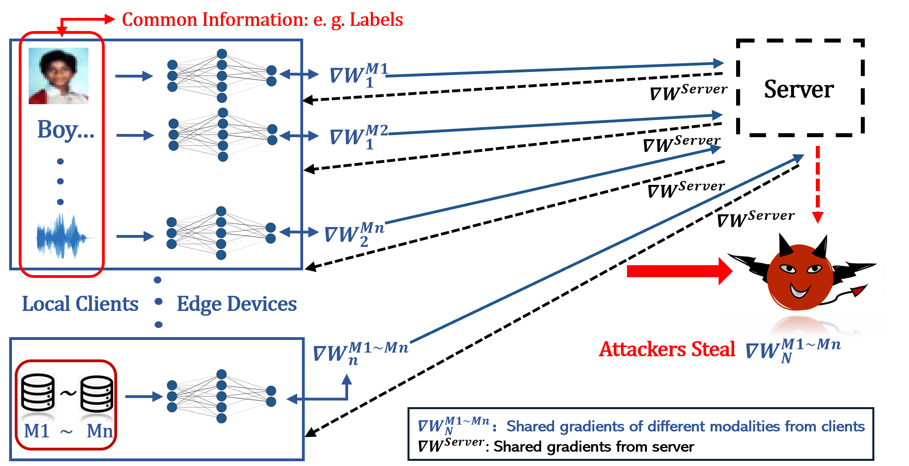
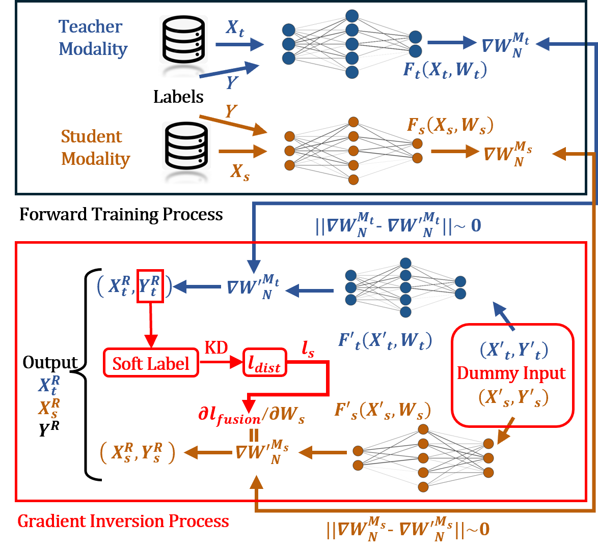
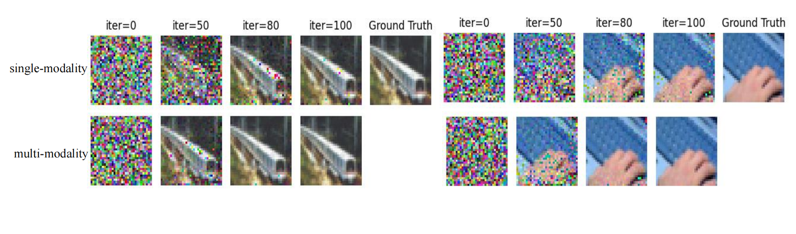

# MGIA: Mutual Gradient Inversion Attack in Multi-Modal Federated Learning  *(AAAI-23 Student Abstract)*

**Xuan Liu, Siqi Cai, Lin Li, Rui Zhang, Song Guo**

**Full Paper**: [https://doi.org/10.1609/aaai.v37i13.26995](https://doi.org/10.1609/aaai.v37i13.26995)  

---

### **Abstract**  
Recent studies have demonstrated that local training data in Federated Learning can be recovered from gradients, which are called gradient inversion attacks. These attacks display powerful effects on either computer vision or natural language processing tasks.  

As it is known that there are certain correlations between multi-modality data, we argue that the threat of such attacks combined with Multi-modal Learning may cause more severe effects. Different modalities may communicate through gradients to provide richer information for the attackers, thus improving the strength and efficiency of the gradient inversion attacks.  

In this paper, we propose the **Mutual Gradient Inversion Attack (MGIA)**, by utilizing the shared labels between image and text modalities combined with the idea of knowledge distillation. Our experimental results show that MGIA achieves the best quality of both modality data and label recoveries in comparison with other methods.  

Meanwhile, MGIA verifies that multi-modality gradient inversion attacks are more likely to disclose private information than the existing single-modality attacks.  

---

### **MGIA Overview**  

| **MGIA Threat Model**                     | **MGIA Method**                     |
|-------------------------------------------|--------------------------------------|
|     |    |  

---

### **Experiment Setup**  
Our experiments are conducted on popular image datasets:  

- **CIFAR-100**  
- **STL-10**  
- **FashionMNIST (FMNIST)**  
- **Flower Images (FI)**  

We add text descriptions for each image to construct multi-modality data. For the experimental environment, we choose the multi-modality prediction task as the target model of our attack.  

Three metrics are adopted to evaluate the reconstruction of images, texts, and labels respectively:  

1. **Average Peak Signal to Noise Ratio (APSNR)**  
2. **Text Recover Rate (RR)**  
3. **Label Recover Accuracy (RA)**  

To compare with single-modality gradient attacks, we use the following baselines:  
- **DLG** (Zhu, Liu, and Han, 2019)  
- **Inverting Gradients (IG)** (Geiping et al., 2020)  
- **GRNN** (Ren, Deng, and Xie, 2022)  

We also present two MGIA variant models:  

- **MGIA (Splicing)**: A splicing model without any multi-modality interaction, used to demonstrate the possibility of recovering multi-modality through single-modality gradient attacks.  
- **MGIA (No KD)**: A weighted average model without knowledge distillation, used to investigate the effect of knowledge distillation.  

---

### **Sample Results**  

---

### **Contact**  
If you have any questions about the code, please feel free to contact:  
- **Xuan Liu** at [xuan18.liu@polyu.edu.hk](mailto:xuan18.liu@polyu.edu.hk)  
- **Siqi Cai** at [csiqi@whut.edu.cn](mailto:csiqi@whut.edu.cn)  
