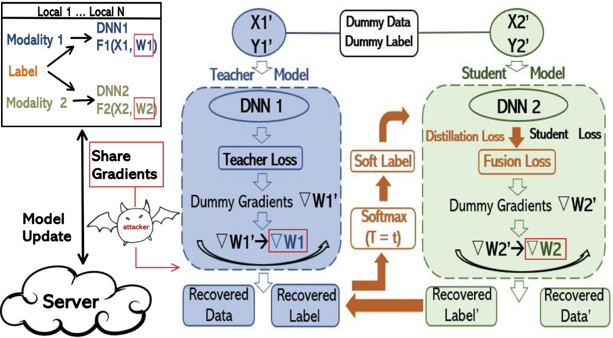
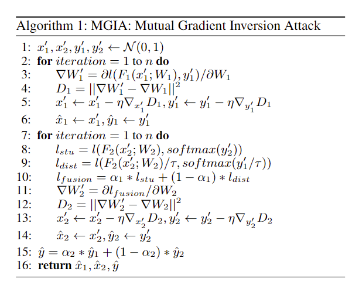

# MGIA
MGIA: Mutual Gradient Inversion Attack in Multi-Modal Federated Learning (AAAI-23 Student Abstract)

FULL Paper：https://doi.org/10.1609/aaai.v37i13.26995

**Abstract**
Recent studies have demonstrated that local training data in Federated Learning can be recovered from gradients, which are called gradient inversion attacks. 
These attacks display powerful effects on either computer vision or natural language processing tasks. As it is known that there are certain correlations between multi-modality data, 
we argue that the threat of such attacks combined with Multi-modal Learning may cause more severe effects. 
Different modalities may communicate through gradients to provide richer information for the attackers, thus improving the strength and efficiency of the gradient inversion attacks. 
In this paper, we propose the Mutual Gradient Inversion Attack (MGIA), by utilizing the shared labels between image and text modalities combined with the idea of knowledge distillation. 
Our experimental results show that MGIA achieves the best quality of both modality data and label recoveries in comparison with other methods. 
In the meanwhile, MGIA verifies that multi-modality gradient inversion attacks are more likely to disclose private information than the existing single-modality attacks.

**MGIA Method**

**MGIA Algorithm**

**Experiment Setup**
Our experiments are conducted on popular image datasets
(CIFAR-100, STL-10, FashionMNIST (FMNIST), Flower
Images (FI) ), and we add text descriptions for each image to
construct multi-modality data. In the construction of the ex-
perimental environment, we choose the multi-modality pre-
diction task as the target model of our attack. Three met-
rics, i.e., Average Peak Signal to Noise Ratio (APSNR), text
Recover Rate (RR), and label Recover Accuracy (RA) are
adopted to evaluate the reconstruction of images, texts, and
labels respectively. To compare with single-modality gradi-
ent attacks, DLG (Zhu, Liu, and Han 2019), Inverting Gradi-
ents (IG) (Geiping et al. 2020), and GRNN (Ren, Deng, and
Xie 2022) are our baselines. We present two MGIA vari-
ant models. MGIA (Splicing) is the splicing model without
any multi-modality interaction, which is used to demonstrate
the possibility of recovering multi-modality through single-
modality gradient attacks. MGIA (No KD) is the weighted
average model without knowledge distillation, which is used
to investigate the effect of knowledge distillation.

**Sample Results**

